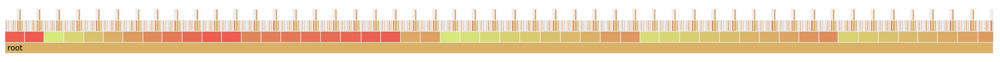
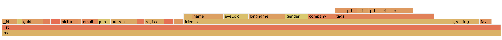

# Usage 

Requires node.  Written using node 11.13.

`> npm install`
`> node parser.js input.json [options]`

Options are -a and -k.

-a : Aggregate mode.
-k : Keys mode.

# About

This tool takes an input JSON, generates an out.json file with the performance data, then starts a local express node app to visualize the data using D3 using d3-flame-graph.

Without any optional parameters, you will see every composite object.  Unfortunately, that output often is impossible to read:

It’s a long array of the same object.  Long lists of items are common and thus I added an extra mode: “(-a)ggregate mode”.

Aggregate mode goes through an array and acts as if each of its child objects are the same object, summing up their contributions into a single object.

This lets you take the first graph, and coalesce it into something much easier to parse visually:

I also added another optional mode: “(-k)eys mode”.  The difference there is only that the objects keys are included in its representation.  This makes a big difference if you are looking to determine excessively long keys and their contributions to the greater object.  Generally, I find it provides a clearer representation to what is going on in the object, so I recommend using it as well.
